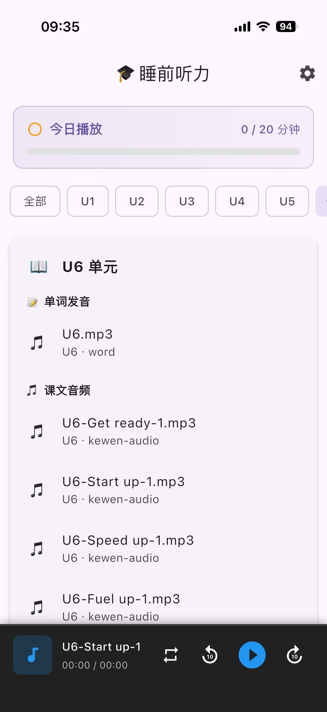
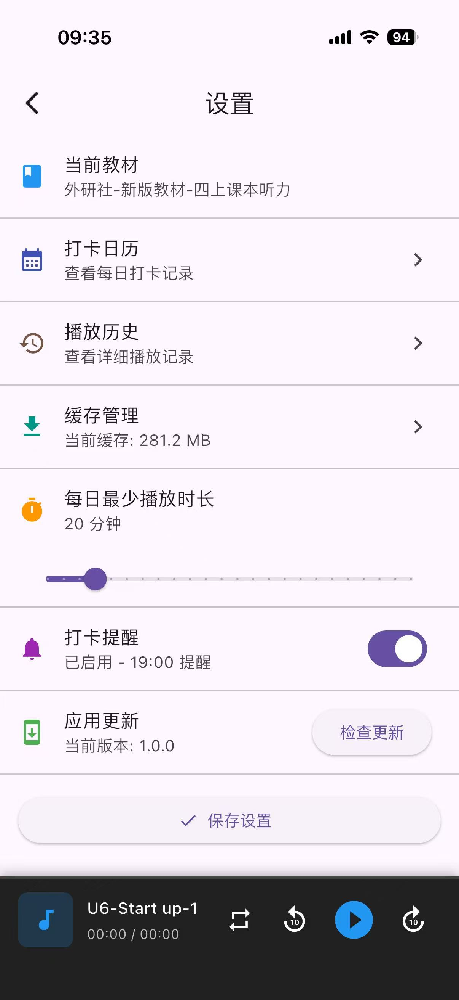
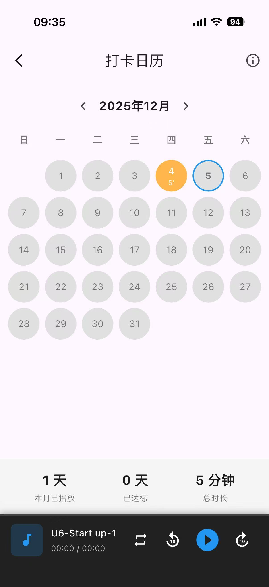
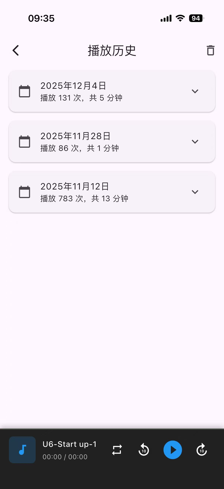
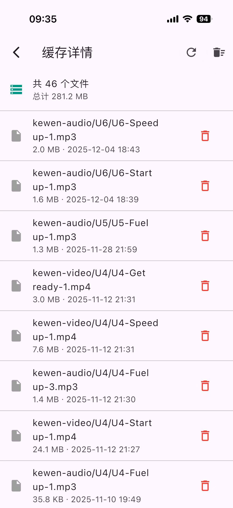
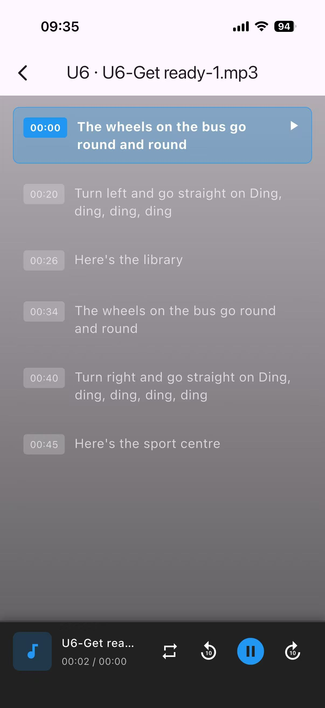
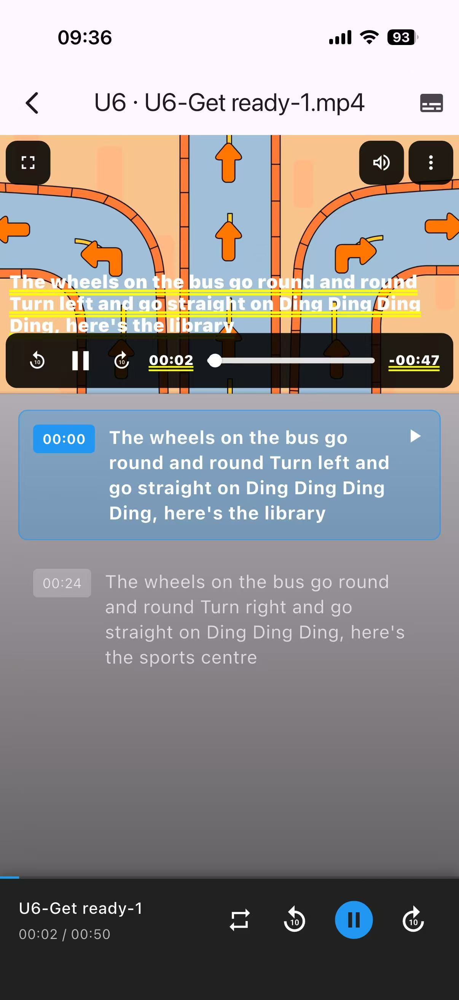

# 睡前听力

写给自家孩子用的睡前听力 App，使用课本为外研社（四上）。欢迎贡献听力资源。

## 功能特点

- 🎧 睡前英语听力练习
- 📚 外研社教材配套音频
- 🌙 适合睡前学习使用
- 📱 支持多平台（iOS、Android、macOS、Web）

## 应用截图

<p align="center">
  
  
  
</p>

<p align="center">
  
  
  
</p>

<p align="center">
  
</p>

## 技术栈

- Flutter 跨平台框架
- Dart 编程语言

## 开发

```bash
# 获取依赖
flutter pub get

# 运行应用
flutter run
```

## 贡献

欢迎贡献听力资源和代码！

## 联系我，备注：睡前听力app

<p align="center">
  
</p>

## 许可证

详见 [LICENSE](LICENSE) 文件
